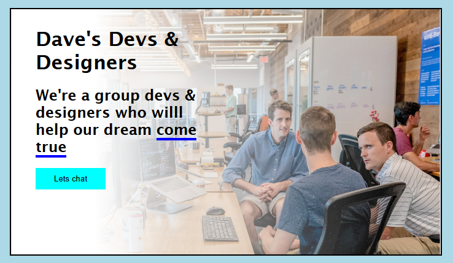

# 👨‍💻 Dave's Devs & Designers Landing Page

A responsive and clean landing page built using **HTML** and **CSS**, presenting a creative developer and design team.

## 🌐 Preview

## ✨ Features

- Bold headline and supporting tagline
- Call-to-action button: "Let's chat"
- Full-width background image
- Responsive layout for all devices
- Stylish font and text highlights
- Built using only HTML & CSS

## 📁 Project Structure

📦 project-root/  
├── index.html  
├── style.css  
└── ACapture.PNG

## 💡 About the Project

> "We're a group devs & designers who will help our dream come true."

This project serves as a basic example of a professional team landing page. Ideal for learning layout design and showcasing developer portfolios.

## 🛠️ Built With

- HTML5  
- CSS3

## 🧑‍💻 Author

**Your Name**  
[GitHub Profile](https://github.com/yourusername)

## 🚀 How to Use

1. Clone the repository:  
   `git clone https://github.com/yourusername/your-repo-name.git`

2. Open `index.html` in your browser to see the landing page.

---

📢 **Feedback and contributions are welcome!**  
⭐ Star the repo if you like it.
